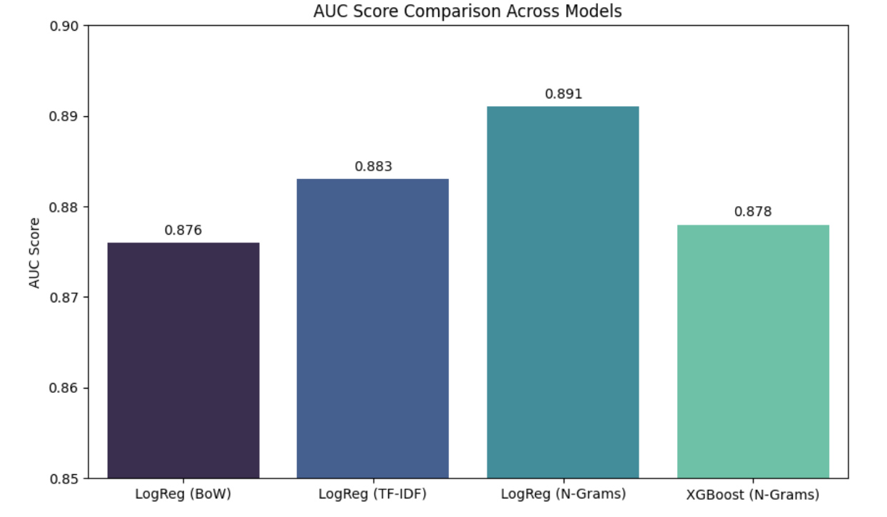
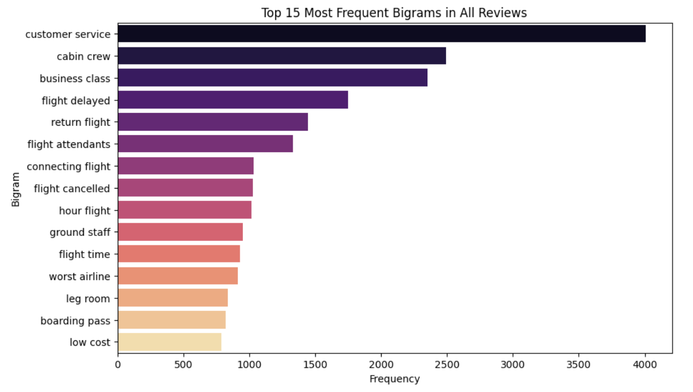

# Airline Review Sentiment Analysis

A Natural Language Processing (NLP) project that predicts whether a passenger will recommend an airline based on their written review. 

## 📊 Overview
This project analyzes passenger flight reviews to classify them into "Recommended" (1) or "Not Recommended" (0). The dataset revealed a class imbalance, with only about 33.6% of the reviews resulting in a recommendation. Various text vectorization techniques and machine learning models were built and compared to find the best performing predictive model.

## 🛠️ Tools & Technologies Used
* **Data Manipulation:** Pandas, NumPy
* **Natural Language Processing (NLP):** NLTK (WordNetLemmatizer, stopwords, word_tokenize), Regular Expressions
* **Machine Learning:** Scikit-Learn (Logistic Regression, CountVectorizer, TfidfVectorizer), XGBoost
* **Evaluation Metrics:** ROC-AUC Score
* **Visualizations:** Matplotlib, Seaborn, WordCloud 

## 🚀 Project Pipeline

1. **Data Preprocessing:**
   * Mapped the "Recommended" target variable from "yes"/"no" strings to binary 1/0 integers.
   * Verified data integrity by checking for null values.

2. **Text Cleaning (NLP):**
   * Converted all text to lowercase.
   * Removed punctuation and extra whitespaces using RegEx.
   * Tokenized text and removed standard English stopwords.
   * Lemmatized words to their base forms using NLTK's WordNetLemmatizer.

3. **Feature Extraction & Modeling:**
   * **Model 1:** Logistic Regression using standard Bag of Words (`CountVectorizer`).
   * **Model 2:** Logistic Regression using Term Frequency-Inverse Document Frequency (`TfidfVectorizer` with min_df=5).
   * **Model 3:** Logistic Regression using N-Grams (1 to 3 words, min_df=5).
   * **Model 4:** XGBoost Classifier using N-Gram features.

## 📈 Key Findings & Results
The models were evaluated using the Area Under the Receiver Operating Characteristic Curve (ROC-AUC) to account for the imbalanced classes. 



* **Logistic Regression (Base Bag of Words):** 0.876 AUC
* **Logistic Regression (TF-IDF):** 0.883 AUC
* **Logistic Regression (N-Grams 1-3):** **0.891 AUC** (Best Performing Model)
* **XGBoost Classifier:** 0.878 AUC

**Text Analysis Insights:** Analyzing the frequency of two-word phrases (bigrams) revealed the core drivers behind passenger reviews. The most heavily discussed topics center on service quality and flight logistics.



As seen in the chart above, the top five most frequent phrases are:
1. **Customer service** (overwhelmingly the most frequent)
2. **Cabin crew**
3. **Business class**
4. **Flight delayed**
5. **Return flight**

*Conclusion: The Logistic Regression model utilizing up to 3-word combinations (trigrams) captured the most context and performed the best at predicting airline recommendations. Furthermore, the NLP analysis clearly shows airlines should focus heavily on customer service and cabin crew interactions, as these are the primary subjects passengers write about.*

## ⚙️ How to Run
1. Clone this repository:
   ```bash
   git clone [https://github.com/yourusername/Airline-Reviews-Sentiment-Analysis.git](https://github.com/yourusername/Airline-Reviews-Sentiment-Analysis.git)
